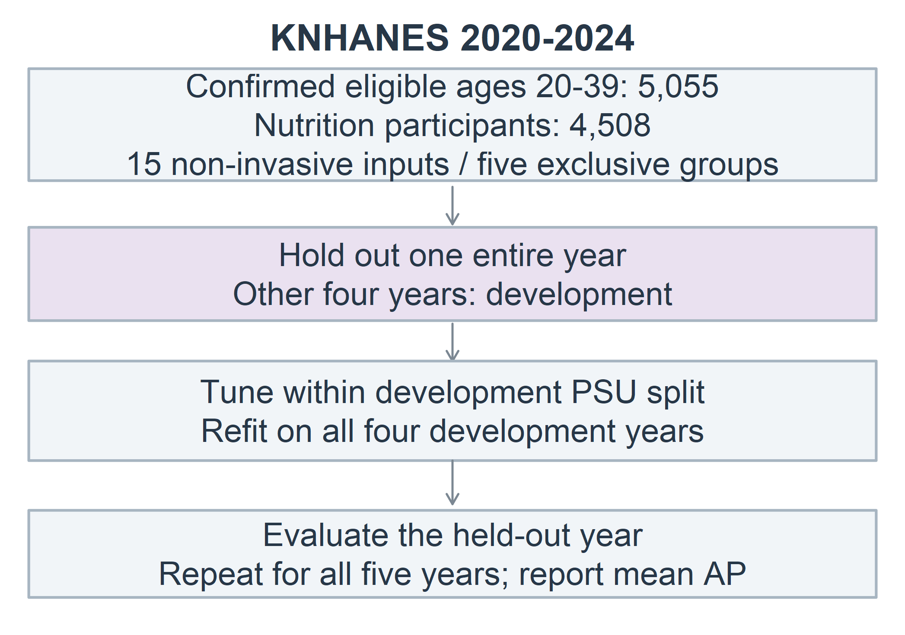
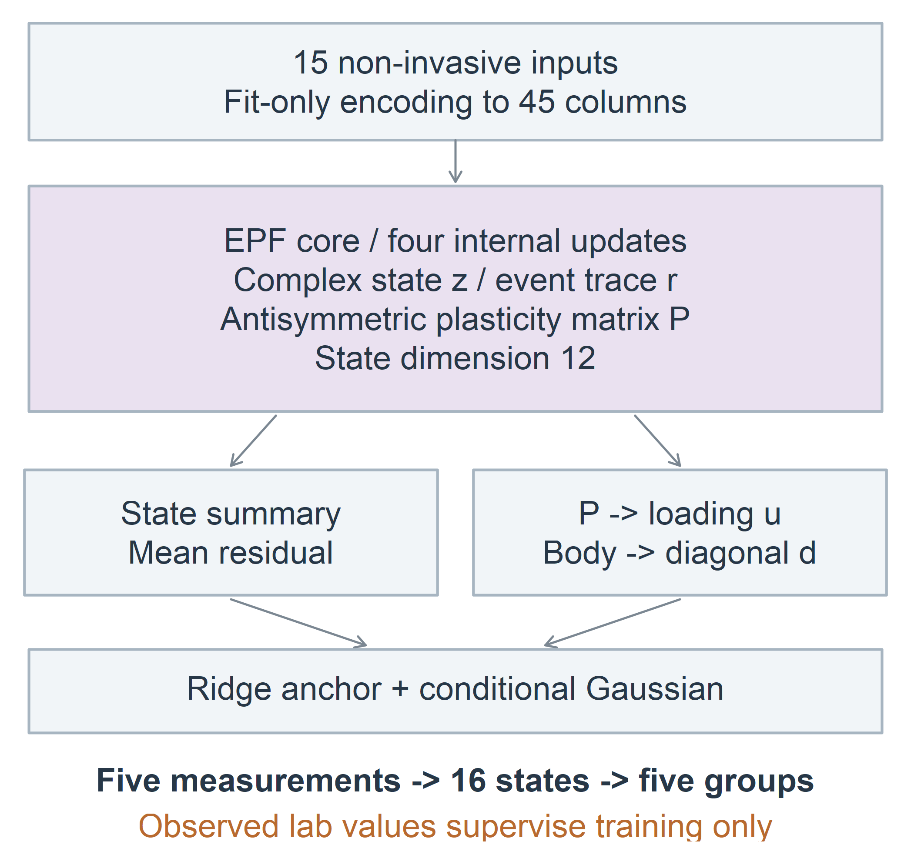
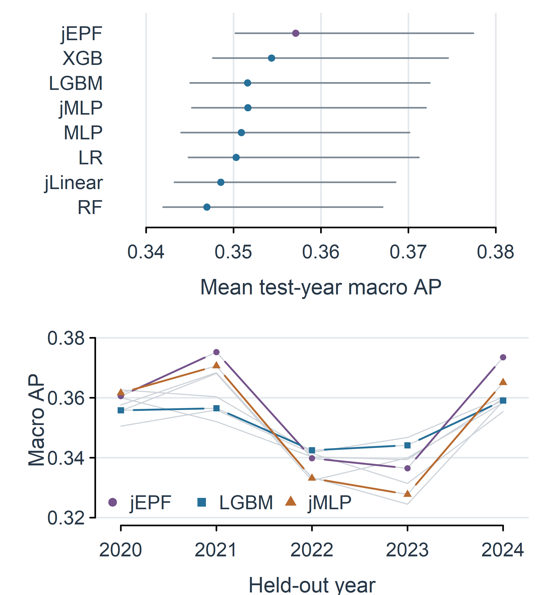
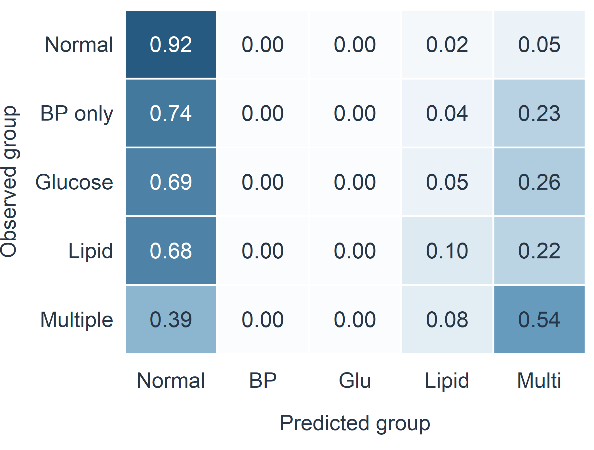
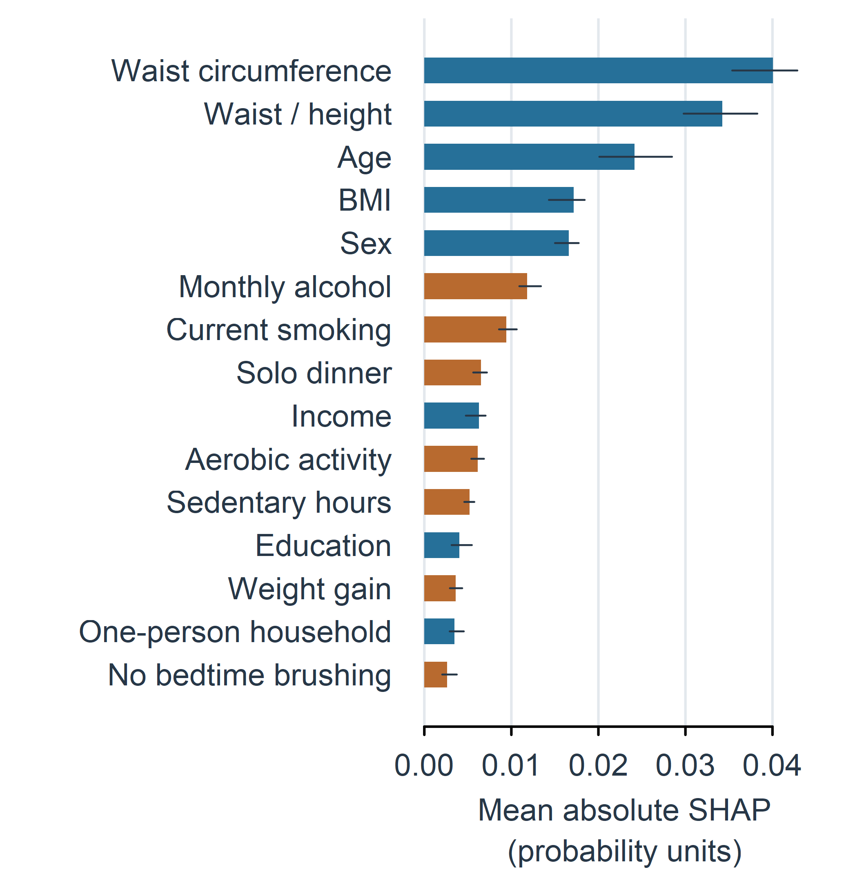

# EPF 신경망을 이용한 청년층 대사이상 유형 분류와 생활습관 관련 요인 분석

EPF Neural Network for Metabolic Abnormality Classification and Lifestyle Analysis in Young Adults

## 요약

본 연구는 국민건강영양조사 2020–2024년 청년 4,508명의 15개 비침습적 입력으로 다섯 대사소견군을 분류하는 EPF 신경망을 평가하였다. 복소 상태·사건 추적·가소성 갱신과 다섯 검사값의 공동분포 출력을 결합하고, 관측 검사값은 학습 정답으로만 사용하였다. 한 해를 시험용으로 남기고 나머지 네 해에서 설정 선택과 전체 재학습을 수행하는 검증을 다섯 번 반복하였다. EPF의 평균 시험연도 macro AP는 0.3571로 비교한 8개 조건 중 가장 높았으나 LightGBM 대비 차이 0.0055의 95% 구간은 [−0.0056, 0.0151]로 우수성이 확인되지는 않았다. EPF 자체의 시험 예측 969명에 대한 SHAP에서는 허리둘레·WHtR·연령의 기여가 높고 생활습관 관련 차이가 관찰되었다. 단독 혈압·혈당군의 결정 성능과 관찰자료의 한계를 함께 제시하며, 설명값을 예방 행동의 인과효과로 해석하지 않았다.

## 1. 서론

청년층 대사이상을 비침습적 정보로 분류하려면 혈당·혈압·지질 소견이 단독으로 나타나는 경우와 함께 나타나는 경우를 구분해야 한다. 한 사람이 여러 소견을 보유할 수 있어 이상 유무만 분류하면 유형에 따른 차이가 가려지고, 학습 자료와 시험 자료가 같은 조사연도에 섞이면 연도 간 변화에 대한 성능도 확인하기 어렵다. 국민건강영양조사는 건강설문·검진·영양조사를 결합한 반복 횡단면 자료이므로 이러한 분류와 조사연도 간 검증을 함께 수행할 수 있다[1].

본 연구는 EPF(Event Plastic Field) 신경망을 중심으로 청년층 대사이상 유형을 분류하고, 그 예측에 기여하는 생활습관 정보를 분석한다. EPF는 복소 잠재 상태·사건 추적·가소성 상태를 내부 반복에서 갱신하며 검사값의 공동분포를 보정하도록 구성하였다. 기존 분류기와의 성능 비교에 더해 같은 공동분포 출력을 사용하는 신경망을 비교군으로 두었고, 다섯 조사연도를 하나씩 제외해 연도 간 일반화를 평가하였다. 설명 분석에는 EPF 자체의 시험 예측을 사용하였다.

## 2. 연구 방법

### 2.1 대상자와 비침습적 입력

질병관리청 국민건강영양조사 2020–2024년 원시자료에서 20–39세를 대상으로 하였다. 고혈압·당뇨·이상지질혈증 진단과 관련 복약이 없다고 확인되고, 비임신 상태와 12시간 이상 공복, 다섯 검사값의 완전 관측 및 유효 조사설계 조건을 충족한 5,055명 중 영양조사 결합 가중치(wt_tot)가 양수인 4,508명을 포함하였다. 저녁 동반 식사 문항이 영양조사에 속하므로 참여 조건을 모든 모델에 동일하게 적용했다. 진단·복약 상태의 모름과 검사값 결측을 정상으로 코딩하지 않았다. 연도별 인원은 851·792·926·965·974명이었다.

예측 입력은 연령·성별·소득·교육, BMI·허리둘레·허리둘레/키 비율(WHtR), 현재흡연·월간음주·유산소 활동·1인가구 여부, 좌식시간·저녁 혼밥·최근 1년 체중 증가·취침 전 칫솔질 미실시의 15개다. 1인가구는 가구원 수 1명으로 정의하였다. 체중 증가는 BO1_1=3, 저녁 혼밥은 L_DN_TO=2로 코딩하고 비해당 응답은 별도 범주로 보존했다. 수치형의 조사 가중 평균·표준편차와 범주형 인코딩은 각 학습 부분에서 적합했으며 결측 지시자를 포함해 45열로 변환하였다. 식별자·조사연도·검사값·진단·복약 문항은 예측 입력에 넣지 않았다.

### 2.2 목표변수

혈당≥100 mg/dL, 수축기 혈압≥130 mmHg 또는 이완기 혈압≥85 mmHg, TG≥150 mg/dL, HDL<40 mg/dL(남성) 또는 <50 mg/dL(여성)을 네 양성 소견으로 정의하였다[2]. TG와 저HDL을 하나의 지질 영역으로 묶고 혈당·혈압·지질의 세 영역 수에 따라 표 1의 배타적 다섯 군을 구성하였다. TG와 저HDL만 함께 이상인 경우는 지질 단독이다. 이 라벨은 측정 당시 검사 소견의 유형이며 질환 확진이나 미래 발병을 뜻하지 않는다.

(표1)

(그림1)

### 2.3 EPF 구조와 검사값 학습 정답

EPF의 입력 X는 위의 15개 비침습적 변수이며, 관측 혈당·혈압·TG·HDL은 입력이 아닌 학습 정답 Y로만 사용한다. 학습 정답은 log 혈당, log 이완기 혈압, log(수축기−이완기 혈압), log TG, log HDL의 다섯 연속값이다. 수축기 혈압은 이완기 혈압과 두 혈압의 차이로 표현하므로 하나의 불명확한 “log 혈압”으로 묶지 않았다. 로그 변환과 표준화의 통계도 학습 자료에서 구하였다.

EPF는 45열 입력을 12차원 복소 상태 z로 투영하고, 사건 추적 r 및 반대칭 가소성 행렬 P와 함께 네 번 갱신한다. 상태 전파와 입력 구동 뒤의 크기 제곱은 사건 발생과 상태 재설정에 사용되며, 사건과 추적 상태의 순서 차이가 P 갱신에 반영된다. 이 계산은 한 사람의 입력을 처리하는 내부 반복으로, 사람을 시간에 따라 추적하거나 생리 상태를 직접 측정하는 과정은 아니다.

상태의 실수·허수·크기·추적·에너지 요약은 평균 보정에 연결하고, P의 네 투영값은 공동분포의 rank-one 적재량에 연결하였다. 연령·체형·성별 맥락은 대각 분산 보정에 사용한다. 평균은 학습 자료의 Ridge 앵커와 신경망 보정량의 합으로, 공분산은 양의 대각 성분과 rank-one 성분의 합으로 구성하였다. 추론에서는 비침습 입력만으로 다섯 검사값의 조건부 분포를 예측하고, 절단값을 적용한 네 소견의 16조합 확률을 적분한 뒤 다섯 군 확률로 합산한다(그림 2).

공동분포 신경망은 조사 가중 가우시안 음의 로그우도(NLL)에 공분산 보정 페널티를 더해 학습했고, 직접 MLP는 가중 교차엔트로피를 사용하였다. EPF·MLP의 선형 skip 경로에는 AdamW 학습률의 0.1배를 적용하였다. 내부 검증의 교차엔트로피 또는 NLL로 epoch를 선택하고, 후보 설정끼리는 검증 macro AP로 비교하였다. 네 개발연도 전체의 재학습에는 선택된 epoch와 학습률 경로를 적용하였다.

(그림2)

### 2.4 비교 모델과 연도 단위 평가

비교군은 다항 로지스틱 회귀(LR), 랜덤 포레스트(RF)[3], XGBoost(XGB)[4], LightGBM(LGBM)[5], 직접 MLP, 공동분포 MLP(jMLP), 공동분포 선형 평균 모델(jLinear)이다. j는 공동분포 출력을 뜻하며 EPF 구조의 이름과 구분하였다. 직접 분류기는 다섯 군 라벨을, 공동분포군은 다섯 연속 검사값을 학습하므로 직접 분류기와의 차이를 구조만의 효과로 해석하지 않는다.

2020–2024년 중 한 해씩을 시험용으로 제외해 다섯 회 평가했다. 나머지 네 해 안에서 조사구(PSU) 기준 80% 학습·20% 검증으로 설정을 선택했으며, 이후 네 해 전체로 전처리·앵커와 모델을 다시 적합했다. 모든 모델에 같은 대상자·분할·입력을 적용하고 모델별 후보 8개를 seed42에서 검증 macro AP로 선택하였다. 최종 예측은 LR의 결정론적 적합 또는 seed42–44 확률 평균이다. 재학습 시 나무 수나 신경망 학습 epoch 및 학습률 경로를 내부 검증 결과로 고정하고 시험 자료를 선택에 사용하지 않았다.

주 지표는 각 시험연도에서 다섯 군을 각각 나머지와 구분하는 조사 가중 average precision(AP)을 평균한 뒤, 다섯 시험연도 점수를 산술평균한 값이다[6]. 전체 OOF 예측을 합친 AP, AUROC·F1·NLL·Brier를 보조 지표로 구했다. 조사 가중치 wt_tot을 적용하고, 연도·층 안에서 전체 조사 PSU를 Rao–Wu 방식으로 2,000회 재표집하였다[7]. 구간은 적합된 모델을 고정한 조건부 구간이며 재학습 불확실성을 포함하지 않는다. 주대조는 EPF−LGBM으로 두고 다른 대비는 보조 분석으로 구분했다.

### 2.5 EPF 기반 SHAP 설명

최종 EPF 앙상블의 다섯 군 확률에 대해 15개 원입력을 순열 기반 SHAP으로 설명하였다[8]. 각 시험연도에서 군별 최대 40명을 무작위 선택한 총 969명에 32쌍의 순·역방향 경로를 적용했고, 배경 표본은 해당 회차의 네 학습연도에서 조사 가중치에 비례해 추출했다. 군별 선택확률의 역수와 조사 가중치를 결합해 중요도를 집계하였다. 경로의 합산 일치와 적분 예측의 기준 계산 일치를 점검했으며, SHAP 패키지의 같은 EPF 함수 설명도 확인하였다. 원입력을 대체한 뒤 인코딩과 신경망·분포 적분을 모두 수행하므로 LightGBM 대리모델의 설명값을 사용하지 않았다.

## 3. 실험 결과

### 3.1 연도별 분류 성능

EPF의 평균 시험연도 macro AP는 0.3571로 8개 조건 중 가장 높았고, XGB 0.3544, LGBM 0.3516가 뒤를 이었다(표 2). EPF−LGBM의 차이는 0.0055였으나 95% 구간 [-0.0056, +0.0151]이 0을 포함하였다. EPF는 LGBM보다 3개 시험연도에서 높았으며, 2022·2023년에는 낮았다. 평균 점추정이 가장 높다는 관찰과 일관된 우수성이 확인됐다는 결론은 구분해야 한다(그림 3).

(표2)

(그림3)

같은 공동분포 출력의 jMLP 대비 EPF 차이는 0.0055, 미보정 95% 구간은 [+0.0002, +0.0104]였고 5개 해 중 4개에서 높았다. 다만 이는 보조 대비이며 다중 비교와 학습 seed 변동을 고려한 구조적 우위의 확증으로 제시하지 않는다. EPF의 단일 seed 평균 연도 AP 범위는 0.3525–0.3575였다. 연도별 AP 평균과 전체 OOF AP는 계산 대상이 다르므로 서로 바꾸어 인용하지 않았다.

### 3.2 아형별 분류와 결정의 한계

EPF 전체 OOF의 군별 AP는 정상 0.8421, 혈압 단독 0.0726, 혈당 단독 0.1040, 지질 단독 0.3129, 복합 0.4087였다. 최대 확률의 한 군을 선택한 조사 가중 혼동행렬에서 정상과 복합군의 재현율은 각각 92.4%, 53.6%였지만 혈압·혈당 단독군은 0%, 지질 단독군은 9.9%였다(그림 4). AP는 순위 성능을 측정하며 이 결정 규칙의 민감도와 같지 않다. 따라서 현재 결과로 단독 소견을 임상적으로 조기 선별할 수 있다고 주장하지 않는다.

(그림4)

### 3.3 EPF가 활용한 생활습관 정보

EPF의 평균 절대 SHAP은 허리둘레 0.0401, WHtR 0.0342, 연령 0.0242, BMI 0.0171, 성별 0.0166 순이었다. 생활습관에서는 월간음주 0.0118과 현재흡연 0.0094가 높았다(그림 5). 신체계측 변수의 상관으로 기여가 분산될 수 있고, 성별은 HDL 절단값의 차이에도 관여하므로 이 순위를 독립적인 생물학적 영향의 크기로 해석하지 않았다.

(그림5)

현재흡연과 좌식시간은 지질 단독·복합군, 체중 증가는 복합군 확률에 양의 기여 차이를 보였고 이러한 방향은 다섯 해에서 유지되었다. 그러나 배타적 아형에서는 한 군의 확률 감소가 다른 군으로의 이동을 반영할 수 있다. 이 부호를 전체 검사 위험 감소로 바꾸어 읽지 않도록 동일 EPF의 네 원래 소견 확률에 대한 SHAP을 보조적으로 확인하였다. 이 보조 분석은 아형 부호를 확인한 뒤 추가한 해석 점검이며 주 성능 비교를 바꾸지 않았다. 중요도와 방향의 재현은 생활습관 관련 후보를 제시하지만, 해당 행동을 바꾸었을 때 건강 결과가 개선된다는 인과효과를 뜻하지 않는다.

## 4. 논의 및 결론

본 연구는 EPF의 상태·사건·가소성 갱신과 공동분포 출력을 비침습적 청년층 대사이상 분류에 적용하고, 한 해씩 제외한 다섯 회 검증과 EPF 자체의 SHAP 분석을 연결하였다. 평균 연도 AP의 점추정은 비교군 중 가장 높았고 같은 공동분포 MLP보다 높은 보조 결과가 관찰되었다. 그러나 LGBM과의 주대조 구간이 0을 포함하고 일부 시험연도 및 단독 아형에서 한계가 남아, 기존 모델 전반에 대한 우월성을 확정하지는 못했다.

분석은 진단·공복·검사 완전성 및 영양조사 참여 조건을 만족한 표본에 제한된다. 2021년 혈압계와 2022년 검사기관·분석법 변경에 대한 별도 전환식 민감도 분석을 수행하지 않았으며, 이미 분석한 KNHANES의 연도 제외 검증을 독립적인 외부 검증으로 부르지 않았다. 다섯 회 중 과거를 학습해 이후 연도를 평가하는 조건은 2024년 시험이다. 횡단면 자료와 SHAP만으로 질환 원인이나 예방 효과를 확인할 수 없고, 실제 자가계측 오차와 임상 절단값도 별도 검증이 필요하다. EPF를 후속 검증할 모델로 제시하면서 생활습관 관련 후보의 재현성을 확인하는 범위에서 결과를 해석한다.

## 참고문헌

[1] S. Kweon et al., “Data Resource Profile: The Korea National Health and Nutrition Examination Survey (KNHANES),” International Journal of Epidemiology, vol. 43, no. 1, pp. 69–77, 2014. doi:10.1093/ije/dyt228.

[2] S. M. Grundy et al., “Diagnosis and management of the metabolic syndrome: an American Heart Association/National Heart, Lung, and Blood Institute Scientific Statement,” Circulation, vol. 112, no. 17, pp. 2735–2752, 2005. doi:10.1161/CIRCULATIONAHA.105.169404.

[3] L. Breiman, “Random Forests,” Machine Learning, vol. 45, no. 1, pp. 5–32, 2001. doi:10.1023/A:1010933404324.

[4] T. Chen and C. Guestrin, “XGBoost: A Scalable Tree Boosting System,” in Proc. ACM SIGKDD, pp. 785–794, 2016. doi:10.1145/2939672.2939785.

[5] G. Ke et al., “LightGBM: A Highly Efficient Gradient Boosting Decision Tree,” in Advances in Neural Information Processing Systems, vol. 30, pp. 3146–3154, 2017.

[6] T. Saito and M. Rehmsmeier, “The Precision-Recall Plot Is More Informative than the ROC Plot When Evaluating Binary Classifiers on Imbalanced Datasets,” PLOS ONE, vol. 10, no. 3, e0118432, 2015. doi:10.1371/journal.pone.0118432.

[7] J. N. K. Rao and C. F. J. Wu, “Resampling Inference with Complex Survey Data,” Journal of the American Statistical Association, vol. 83, no. 401, pp. 231–241, 1988. doi:10.1080/01621459.1988.10478591.

[8] S. M. Lundberg and S.-I. Lee, “A Unified Approach to Interpreting Model Predictions,” in Advances in Neural Information Processing Systems, vol. 30, pp. 4765–4774, 2017.

표 1. 다섯 대사소견군의 정의와 비가중 인원

| 군 | 정의 | n |
|---|---|---|
| 정상 | 네 소견 모두 음성 | 2,796 |
| 혈압 단독 | 혈압 영역만 양성 | 183 |
| 혈당 단독 | 혈당 영역만 양성 | 233 |
| 지질 단독 | 지질 영역만 양성 | 813 |
| 복합 | 세 영역 중 두 영역 이상 양성 | 483 |

그림 1. 대상자 선정과 연도 제외 검증의 흐름. 한 해 전체를 시험용으로 남기고 나머지 네 해에서 학습·설정 선택·재학습을 수행하였다.

그림 2. EPF의 입력·내부 상태·공동분포 출력. 관측 검사값은 학습 정답 경로에만 사용하며 예측 시 입력하지 않는다.

표 2. 동일 표본에서의 연도 제외 분류 성능

| 모델 | 평균 연도 AP | 95% 구간 | 전체 OOF AP |
|---|---|---|---|
| jEPF | 0.3571 | 0.3502–0.3774 | 0.3481 |
| XGB | 0.3544 | 0.3476–0.3745 | 0.3438 |
| jMLP | 0.3516 | 0.3452–0.3720 | 0.3436 |
| LGBM | 0.3516 | 0.3450–0.3725 | 0.3406 |
| MLP | 0.3509 | 0.3440–0.3701 | 0.3395 |
| LR | 0.3503 | 0.3448–0.3712 | 0.3358 |
| jLinear | 0.3485 | 0.3432–0.3685 | 0.3417 |
| RF | 0.3470 | 0.3419–0.3671 | 0.3347 |

그림 3. 모델별 평균 시험연도 AP와 95% 조건부 구간(위), 시험연도별 AP(아래). 흐린 선은 나머지 비교 모델이다.

그림 4. EPF 전체 OOF 예측의 조사 가중 행 정규화 혼동행렬. 결정 규칙은 다섯 군 중 최대 확률 선택이다.

그림 5. EPF의 15개 원입력에 대한 평균 절대 SHAP. 주황색은 생활습관 입력이며 선은 다섯 시험연도 값의 범위로 신뢰구간이 아니다.
