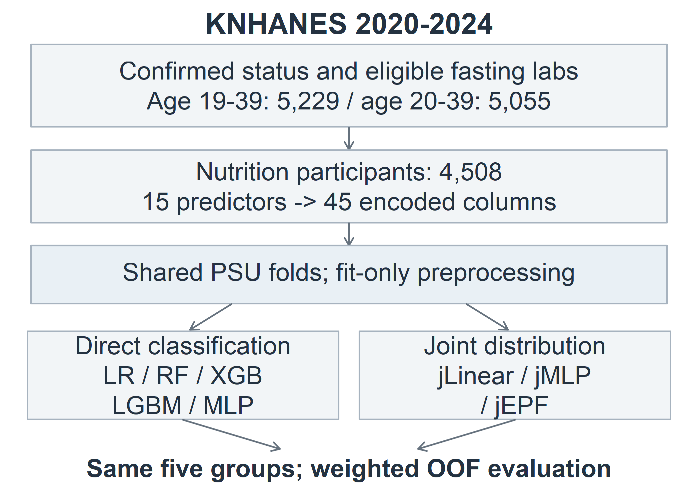
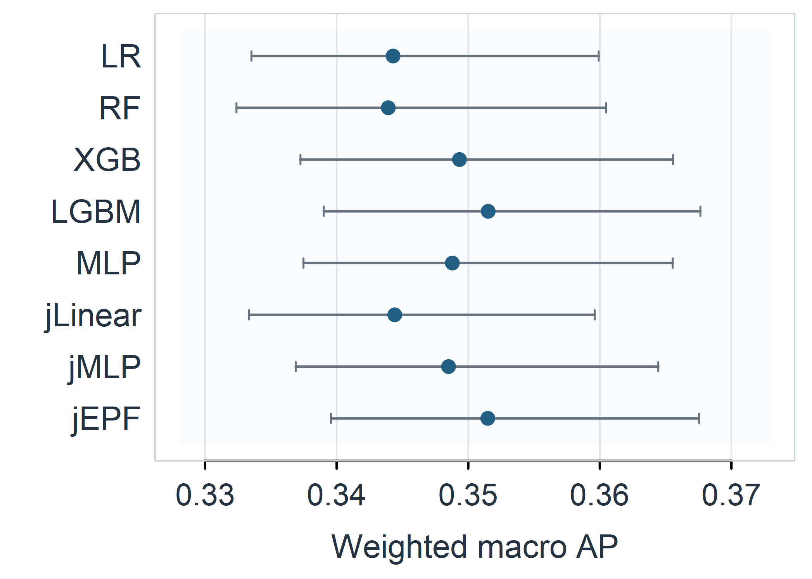
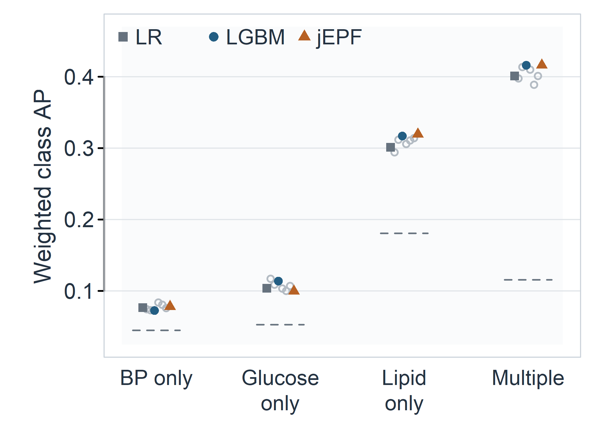

# 청년층 미인지 대사이상의 비침습적 유형 분류를 위한 머신러닝 모델 비교

Comparison of Machine Learning Models for Non-Invasive Classification of Unrecognized Metabolic Abnormalities in Young Adults

## 요약

혈당·혈압·지질 이상을 하나의 이진 결과로 묶으면 소견의 유형에 따른 분류 난이도가 드러나지 않는다. 본 연구는 국민건강영양조사 2020–2024년 자료에서 기존 진단과 관련 복약이 없는 20–39세 4,508명을 선정하고, 신체계측과 생활습관 등 15개 비침습적 입력으로 정상·혈압 단독·혈당 단독·지질 단독·복합의 다섯 군을 분류하였다. 로지스틱 회귀, 랜덤 포레스트, 두 부스팅 모델, MLP 및 공동분포를 학습하는 세 모델을 같은 대상자와 조사구 단위 교차검증에서 비교하였으며, 직접 구현한 EPF 신경망을 공동분포 비교군에 포함하였다. 조사 가중 macro AP는 LightGBM 0.3515, EPF 0.3515, 로지스틱 회귀 0.3443이었다. EPF와 공동분포 MLP의 차이는 0.0030이었으나 95% 구간이 −0.0024–0.0088로 0을 포함하였다. 정상군보다 단독 혈압·혈당군의 AP가 낮아, 전체 점수만으로 선별 성능을 판단하기 어려웠다. 이 결과는 특정 구조의 우월성보다 대사소견 유형별 평가와 출력 설계를 구분한 비교가 필요함을 보여준다.

## 1. 서론

비침습적 정보로 대사이상 가능성을 가려내는 모델은 혈액검사 이전 단계에서 활용할 수 있지만, 이상 유무만 분류하면 서로 다른 소견이 같은 양성군에 포함된다. 혈당 상승 한 가지가 있는 사람과 혈당·혈압·지질 이상이 함께 있는 사람은 같은 결과로 표현되고, 모델이 어느 유형을 잘 구분했는지도 알기 어렵다. 따라서 조기 선별을 검토하려면 종합 점수와 함께 유형별 분류 성능을 확인해야 한다.

국민건강영양조사는 건강설문·검진·영양조사를 결합한 반복 횡단면 자료로, 계측과 생활습관을 검사 결과에 연결해 분석할 수 있다[1]. 본 연구는 2020–2024년의 청년 자료에서 배타적인 다섯 대사소견군을 정의하고, 기존 머신러닝 모델과 직접 구현한 EPF 신경망을 동일한 입력과 표본에서 비교하였다. EPF는 비교 대상 중 하나로 두었으며, 신경망 구조와 연속 검사값을 학습하는 출력 설계의 영향을 혼동하지 않도록 같은 공동분포 출력을 사용하는 MLP와 선형 평균 모델도 포함하였다.

## 2. 연구 방법

### 2.1 자료와 대상자

질병관리청이 공개한 2020–2024년 원시자료를 사용하였다. 고혈압·당뇨·이상지질혈증의 기존 진단이 없고 관련 약물을 복용하지 않는다고 확인된 사람 중, 비임신 상태와 12시간 이상 공복이 확인되고 혈당·수축기 및 이완기 혈압·중성지방(TG)·HDL이 모두 관측된 대상을 남겼다. 검사값이 양수이고 수축기 혈압이 이완기 혈압보다 높으며 조사 설계정보가 유효한 19–39세는 5,229명이었다. 이를 20–39세 5,055명으로 제한한 뒤 영양조사 결합 가중치(wt_tot)가 양수인 4,508명을 분석하였다. 저녁 식사 관련 문항이 영양조사에 속하므로 같은 참여 집단을 모든 모델에 적용하였다.

연도별 인원은 2020년 851명, 2021년 792명, 2022년 926명, 2023년 965명, 2024년 974명이었다. 진단·복약·임신 상태의 모름과 정답 검사값의 결측은 정상으로 처리하지 않았다. 여기서 미인지는 진단과 관련 복약이 없다는 조작적 정의이며, 본인이 검사 결과를 전혀 알지 못한다는 사실까지 확인한 것은 아니다.

### 2.2 목표변수와 비침습적 입력

대사증후군 구성요소의 절단값을 참고해 혈당≥100 mg/dL, 수축기 혈압≥130 mmHg 또는 이완기 혈압≥85 mmHg, TG≥150 mg/dL, HDL<40 mg/dL(남성) 또는 <50 mg/dL(여성)를 각각 양성 소견으로 정의하였다[2]. TG와 저HDL을 하나의 지질 영역으로 묶어 혈당·혈압·지질 세 영역을 세었고, 표 1처럼 배타적인 다섯 군으로 구성하였다. TG와 저HDL만 함께 이상인 경우도 지질 단독에 속한다. 이 라벨은 검사 소견을 나타내며 질환 확진이나 대사증후군 진단과 같지 않다.

표 1. 대사소견군의 정의와 비가중 인원

| 군 | 정의 | n |
|---|---|---|
| 정상 | 네 소견 모두 음성 | 2,796 |
| 혈압 단독 | 혈압 영역만 양성 | 183 |
| 혈당 단독 | 혈당 영역만 양성 | 233 |
| 지질 단독 | 지질 영역만 양성 | 813 |
| 복합 | 세 영역 중 두 영역 이상 양성 | 483 |

원자료에서 선택한 29개 열에는 검사값과 대상자 선별 문항이 포함되므로, 실제 예측 입력은 15개였다. 연령·성별·소득·교육, BMI·허리둘레·허리둘레/키 비율(WHtR), 현재흡연·월간음주·유산소 활동·1인가구 여부에 좌식시간·저녁 혼밥·최근 1년 체중 증가·취침 전 칫솔질 미실시를 더했다. 1인가구는 가구원 수 1명으로 정의했으며 실제 자취 여부를 직접 측정한 변수로 해석하지 않았다.

코드북에 따라 체중 변화는 BO1_1의 3을 증가로, 저녁 동반 식사는 L_DN_TO의 2를 혼밥으로 코딩하였다. 저녁 식사 빈도에 따른 비해당 응답은 별도 범주로 보존했다. 수치형 표준화의 가중 평균과 표준편차는 학습 부분에서만 구했고, 결측 지시자와 범주형 인코딩을 포함해 45열로 변환하였다. 검사값·진단·복약·개인 식별자는 추론 입력에 넣지 않았다.

그림 1. 공통 대상자 선정과 두 학습 경로. 모든 모델에 같은 15개 입력과 조사구 분할을 적용하였다.

### 2.3 비교 모델과 공동분포 출력

직접 분류군은 다항 로지스틱 회귀(LR), 랜덤 포레스트(RF)[3], XGBoost(XGB)[4], LightGBM(LGBM)[5], MLP로 구성하였다. 공동분포군은 선형 평균 모델(jLinear), MLP(jMLP), EPF(jEPF)로 구성했으며, j는 공동분포 출력을 뜻한다. 공동분포군은 log 혈당, log 이완기 혈압, log(수축기−이완기 혈압), log TG, log HDL의 조건부 정규분포를 학습한다. 공분산은 대각 성분과 rank-one 성분의 합으로 나타내고, 학습 자료로 구한 Ridge 평균 앵커를 사용하였다.

학습된 분포에서 네 소견의 16개 조합 확률을 계산한 뒤, 표 1의 다섯 군 확률로 합산하였다. 연속 검사값은 학습 정답으로만 사용하며 추론 시에는 비침습적 입력만 필요하다. 직접 분류군이 다섯 군 라벨을 학습하는 것과 달리 공동분포군은 검사값의 연속 정보도 이용하므로, 두 군 사이의 차이를 신경망 구조만의 효과로 볼 수는 없다.

EPF는 12차원 복소 상태, 사건 추적 상태, 반대칭 가소성 행렬을 네 번의 내부 반복에서 함께 갱신하는 구현을 사용하였다. 상태 요약은 검사값의 평균 보정에, 가소성 행렬의 네 투영값은 공분산 보정에 연결하였다. 이는 한 사람의 입력을 처리하는 내부 계산이며 실제 시간에 따른 건강 변화를 추적하는 시계열 모델은 아니다. 평균·공분산이라는 같은 출력 형식을 jMLP와 jLinear에도 적용하여 비교했다. 내부 상태를 실제 생리 기전으로 해석하지는 않았다.

### 2.4 학습과 평가

연도별 균형을 고려해 조사구(PSU)를 다섯 외부 fold로 나누었고, 외부 학습 부분은 다시 PSU 기준 80% 학습·20% 검증으로 나누었다. 같은 조사구와 가구가 역할 사이에 겹치지 않도록 확인하였다. 모델별 후보 설정 8개를 seed 42에서 평가해 검증 macro AP로 선택했으며, LR을 제외한 최종 예측은 seed 42–44의 확률 평균을 사용했다. 모든 사람은 외부 평가에 한 번씩 포함되어 out-of-fold(OOF) 예측을 얻었다. 직접 신경망은 교차엔트로피, 공동분포 신경망은 Gaussian NLL로 학습·중단하되 후보 선택 지표는 통일하였다.

주 지표는 다섯 군 각각을 나머지와 구분하는 조사 가중 average precision(AP)의 산술평균이다. 클래스 불균형에서 양성 예측의 정확도와 재현율을 함께 살피기 위해 AP를 사용했고[6], macro AUROC·macro F1·NLL·Brier를 보조 지표로 계산하였다. F1은 최대 확률의 군을 선택해 구했다. wt_tot을 학습 부분의 평균이 1이 되도록 정규화했으며, 평가는 원래 조사 가중치를 적용했다.

95% 구간은 연도와 층 안에서 전체 조사 PSU를 Rao–Wu 방식으로 2,000회 재표집해 구하였다[7]. 같은 재표집 가중치를 모델 간 차이에도 적용했다. 이 구간은 적합된 모델의 OOF 예측을 고정한 조건부 구간으로, 재학습과 추가 튜닝에 따른 변동은 포함하지 않는다. 사전 지정한 주대조는 jEPF−jMLP의 macro AP이며, 다른 모델과의 차이는 보조 비교로 해석하였다.

## 3. 실험 결과

### 3.1 전체 성능과 모델 간 차이

표 2에서 macro AP가 가장 높은 모델은 LGBM(0.3515)이었고 jEPF(0.3515)가 비슷한 값을 보였다. LR은 0.3443, 직접 MLP는 0.3488이었다. 그러나 jEPF−LR 차이 0.0072의 95% 구간은 −0.0041–0.0177이었고, jEPF−LGBM 차이는 −0.00003(−0.0092–0.0100)이었다. 점추정 순위는 관찰되지만 이 결과만으로 jEPF가 기존 모델보다 우수하다고 결론 내릴 근거는 없다(그림 2).

표 2. 조사 가중 OOF 성능 비교

| 모델 | macro AP | AUROC | macro F1 | NLL |
|---|---|---|---|---|
| LR | 0.3443 | 0.7282 | 0.2710 | 0.9926 |
| RF | 0.3439 | 0.7268 | 0.2739 | 0.9910 |
| XGB | 0.3493 | 0.7334 | 0.2843 | 0.9842 |
| LGBM | 0.3515 | 0.7321 | 0.2824 | 0.9870 |
| MLP | 0.3488 | 0.7320 | 0.2731 | 0.9881 |
| jLinear | 0.3444 | 0.7372 | 0.2607 | 0.9885 |
| jMLP | 0.3485 | 0.7357 | 0.2746 | 0.9850 |
| jEPF | 0.3515 | 0.7354 | 0.2829 | 0.9857 |

그림 2. 모델별 macro AP와 95% PSU 재표집 구간. 작은 차이가 보이도록 가로축을 확대하였다.

같은 공동분포 출력을 사용하는 jMLP의 macro AP는 0.3485였다. 주대조 jEPF−jMLP는 0.0030, 95% 구간은 −0.0024–0.0088로 0을 포함하였다. macro AUROC는 jLinear가 0.7372로 가장 높았지만 이 모델의 macro AP는 0.3444로 낮은 편이었다. 따라서 순위 구분, 양성군 회수, 확률의 적합성을 함께 살펴야 하며 한 지표의 순위를 전체 성능으로 바꿔 읽어서는 안 된다.

### 3.2 대사소견 유형별 성능

jEPF의 군별 AP는 정상 0.8439, 혈압 단독 0.0782, 혈당 단독 0.0996, 지질 단독 0.3196, 복합 0.4162였다. 그림 3처럼 단독 혈압·혈당군의 낮은 AP는 다른 모델에서도 나타났다. jEPF가 일부 군에서 높은 값을 보여도 모든 군에서 일관되게 가장 좋은 것은 아니었다. 혈압 단독에서는 직접 MLP가 0.0838, 혈당 단독에서는 RF가 0.1170으로 더 높았다.

그림 3. 이상소견 네 군의 AP. 빈 원은 나머지 비교 모델이며 점선은 각 군의 조사 가중 비율이다. 점의 가로 이동은 겹침을 피하기 위한 표시다.

정상군은 전체의 62.0%인 반면 혈압·혈당 단독군은 각각 4.1%, 5.2%였다(비가중 비율). 작은 양성군에서의 성능과 정상군의 높은 AP를 구분해 제시해야 비침습적 선별이 어느 유형까지 가능한지 판단할 수 있다. macro AP는 이 차이를 평균에 반영하지만, 단독 소견을 놓치는 문제 자체를 해소하지는 않는다.

## 4. 논의 및 결론

2020–2024년 청년 표본에서 다섯 대사소견군을 비교한 결과, LGBM과 jEPF의 macro AP는 거의 같았으며 jEPF의 구조적 우위를 확인하지 못했다. 공동분포 모델은 검사값의 연속 정보와 소견 조합을 함께 표현할 수 있지만, 이번 자료에서 그 표현이 다섯 군의 분류 성능을 일관되게 높이지는 않았다. EPF도 동일한 조건에서 검토할 수 있는 신경망 비교군으로서 의미가 있다.

주 지표와 계산 경로를 함께 고려하면 LGBM은 추가적인 분포 적분 없이 다섯 군을 직접 분류하는 우선 검토 후보이고, LR은 비교 기준으로 유지할 수 있다. 여러 소견의 조합 확률까지 출력해야 하는 경우에는 공동분포 모델이 별도의 후보가 된다. 다만 군별 AP가 낮은 혈압·혈당 단독군까지 실제 선별에 쓰려면 독립 자료에서 민감도·양성예측도와 의뢰율을 확인해야 한다. 본 비교에는 임상 적용을 위한 절단값 검증이 포함되지 않았다.

분석 대상은 진단·복약·공복·검사 완전성 및 영양조사 참여 조건을 충족한 사람으로 제한되어 전체 청년층과 다를 수 있다. 자가계측 자료가 아니라 조사에서 측정한 BMI·허리둘레를 사용했으므로, 가정에서 측정할 때의 오차도 따로 평가해야 한다. 연도별 혈압계와 검사기관·분석법 변경에 대한 별도 전환식 민감도 분석을 수행하지 않았으며, 반복 횡단면 자료만으로 미래 발병이나 생활습관의 원인 효과를 추론할 수 없다. 모델 재학습 불확실성과 다중 보조 비교도 남아 있는 한계다.

본 연구는 청년층 대사소견을 다섯 군으로 나누고 공통 표본·입력·조사구 분할에서 기존 분류기와 구현 신경망을 비교한 결과를 제시하였다. 현재 결과는 특정 모델의 임상적 우수성보다 유형별 분류의 한계를 보여준다. 후속 적용에서는 LGBM을 직접 분류의 우선 후보로 검토하되 LR과의 비교를 유지하고, 소견 조합 출력이 필요한 목적에 한해 공동분포 모델의 추가 가치를 평가할 수 있다.

## 참고문헌

[1] S. Kweon et al., “Data Resource Profile: The Korea National Health and Nutrition Examination Survey (KNHANES),” International Journal of Epidemiology, vol. 43, no. 1, pp. 69–77, 2014. doi:10.1093/ije/dyt228.

[2] S. M. Grundy et al., “Diagnosis and management of the metabolic syndrome: an American Heart Association/National Heart, Lung, and Blood Institute Scientific Statement,” Circulation, vol. 112, no. 17, pp. 2735–2752, 2005. doi:10.1161/CIRCULATIONAHA.105.169404.

[3] L. Breiman, “Random Forests,” Machine Learning, vol. 45, no. 1, pp. 5–32, 2001. doi:10.1023/A:1010933404324.

[4] T. Chen and C. Guestrin, “XGBoost: A Scalable Tree Boosting System,” in Proc. ACM SIGKDD, pp. 785–794, 2016. doi:10.1145/2939672.2939785.

[5] G. Ke et al., “LightGBM: A Highly Efficient Gradient Boosting Decision Tree,” in Advances in Neural Information Processing Systems, vol. 30, pp. 3146–3154, 2017.

[6] T. Saito and M. Rehmsmeier, “The Precision-Recall Plot Is More Informative than the ROC Plot When Evaluating Binary Classifiers on Imbalanced Datasets,” PLOS ONE, vol. 10, no. 3, e0118432, 2015. doi:10.1371/journal.pone.0118432.

[7] J. N. K. Rao and C. F. J. Wu, “Resampling Inference with Complex Survey Data,” Journal of the American Statistical Association, vol. 83, no. 401, pp. 231–241, 1988. doi:10.1080/01621459.1988.10478591.
