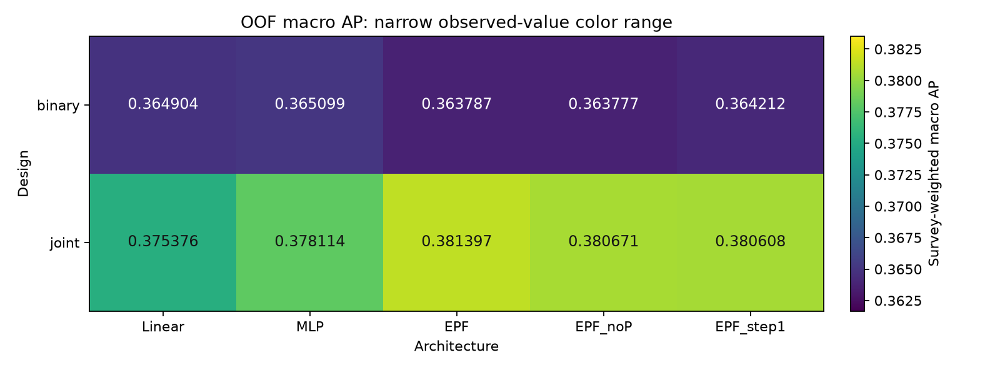
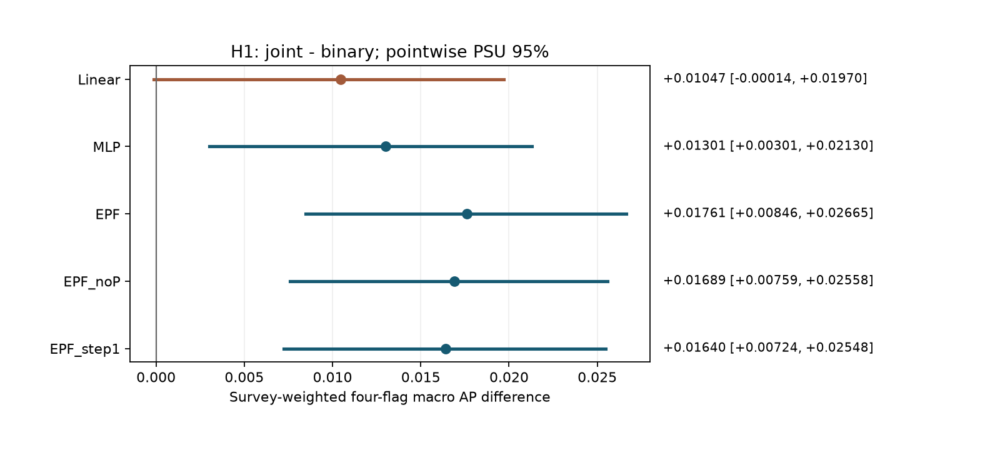
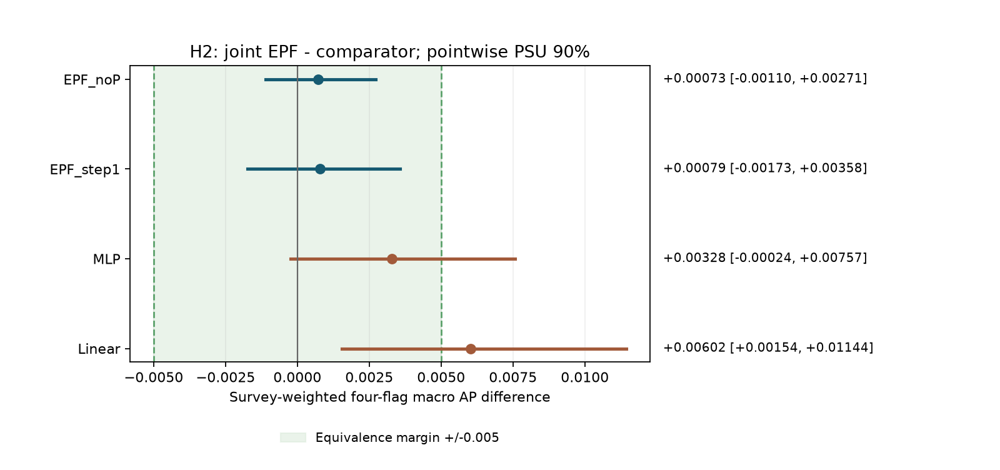

# Clinical v28: 설계 × 구조 요인 비교

**사전 지정 결합 기준 미충족**. H1 다섯 구조 모두 충족: **False**, H2 noP·step1 모두 충족: **True**, H2 네 대조 모두 충족: **False**. 이 판정은 아래에 고정한 탐색 비교의 기준 충족 여부다. 보편적인 구조 무관성이나 정확한 0 효과를 뜻하지 않는다.

10칸 × 설정 4개 × seed 5개 × fold 5개 = **1,000회 학습**. validation+calibration proper score의 seed 평균으로 50개 설정을 고르고, 선택된 250개 체크포인트의 seed 혼합을 한 번 평가했다. 조기종료는 각 설계의 validation 점수(binary BCE / joint Gaussian NLL)를 사용했다.

## 설계 효과 평균과 joint 구조 간 관측 범위

| 요약 | AP 차이 | PSU 구간 / 해석 |
| --- | --- | --- |
| 설계 효과 평균 (joint − binary) | +0.014877 | 95% [+0.005534, +0.023615]; 90% [+0.007091, +0.022197] |
| joint 다섯 구조의 최대 − 최소 | 0.006020 | 기술 통계; 신뢰구간 아님 |

joint 최솟값 **0.375376** (Linear), 최댓값 **0.381397** (EPF). 이 두 요약만으로 설계 효과와 구조 효과의 통계적 우열을 검정하지 않는다.

## OOF macro AP: 2 × 5

| 설계 | Linear | MLP | EPF | EPF_noP | EPF_step1 |
| --- | --- | --- | --- | --- | --- |
| binary | 0.364904 | 0.365099 | 0.363787 | 0.363777 | 0.364212 |
| joint | 0.375376 | 0.378114 | 0.381397 | 0.380671 | 0.380608 |

색 범위는 관측 AP 주변의 좁은 구간이다. 숫자 라벨을 함께 읽고 시각적 대비를 절대 효과 크기로 해석하지 않는다.

## Flag별 AP

| 칸 | elevated_glucose | elevated_bp | elevated_tg | low_hdl |
| --- | --- | --- | --- | --- |
| binary_Linear | 0.369291 | 0.274778 | 0.440659 | 0.374889 |
| binary_MLP | 0.368568 | 0.273949 | 0.441484 | 0.376397 |
| binary_EPF | 0.368230 | 0.274522 | 0.437698 | 0.374700 |
| binary_EPF_noP | 0.368295 | 0.274425 | 0.437659 | 0.374730 |
| binary_EPF_step1 | 0.368023 | 0.275232 | 0.437667 | 0.375924 |
| joint_Linear | 0.378455 | 0.283744 | 0.456604 | 0.382702 |
| joint_MLP | 0.381870 | 0.284281 | 0.458722 | 0.387583 |
| joint_EPF | 0.385222 | 0.288002 | 0.463364 | 0.388999 |
| joint_EPF_noP | 0.380947 | 0.286890 | 0.464769 | 0.390079 |
| joint_EPF_step1 | 0.380929 | 0.284394 | 0.467485 | 0.389624 |

## 16상태 categorical NLL: 2 × 5 (낮을수록 좋음)

| 설계 | Linear | MLP | EPF | EPF_noP | EPF_step1 |
| --- | --- | --- | --- | --- | --- |
| binary | 1.388554 | 1.386931 | 1.389019 | 1.389031 | 1.388051 |
| joint | 1.359474 | 1.365152 | 1.364834 | 1.365113 | 1.364207 |

p16은 seed별 공동분포를 평균한 혼합이다. binary의 각 seed는 독립 Bernoulli 곱이고, 혼합은 `mean_seed(product_flag(Bernoulli))`다. `product_flag(Bernoulli(mean_seed(p4)))`로 재계산하지 않았다.

## Fold별 macro AP

| 칸 | fold 1 | fold 2 | fold 3 | fold 4 | fold 5 |
| --- | --- | --- | --- | --- | --- |
| binary_Linear | 0.387081 | 0.374945 | 0.347218 | 0.370144 | 0.412059 |
| binary_MLP | 0.387723 | 0.375597 | 0.347141 | 0.369816 | 0.410935 |
| binary_EPF | 0.387904 | 0.370103 | 0.347387 | 0.369393 | 0.412582 |
| binary_EPF_noP | 0.388237 | 0.370041 | 0.347392 | 0.369435 | 0.412581 |
| binary_EPF_step1 | 0.387087 | 0.370941 | 0.347289 | 0.369644 | 0.413606 |
| joint_Linear | 0.407111 | 0.399494 | 0.347792 | 0.374686 | 0.413075 |
| joint_MLP | 0.411573 | 0.396608 | 0.356592 | 0.373273 | 0.416910 |
| joint_EPF | 0.410150 | 0.392860 | 0.366268 | 0.387941 | 0.417180 |
| joint_EPF_noP | 0.408423 | 0.396405 | 0.360458 | 0.385695 | 0.416828 |
| joint_EPF_step1 | 0.408241 | 0.398534 | 0.363555 | 0.381480 | 0.417424 |

PSU 요청 **2000회**, 유효 **2000회**. 아래 구간은 고정 OOF 예측에 조건부인 pointwise percentile 구간이며 다중비교 보정이 없다.

## H1: 다섯 구조에서 joint − binary

95% 구간 하한이 엄격히 0보다 크면 충족한다.

| 대조 | 점추정 | PSU 95% | fold 1 | fold 2 | fold 3 | fold 4 | fold 5 | 충족 |
| --- | --- | --- | --- | --- | --- | --- | --- | --- |
| joint_Linear-binary_Linear | +0.010472 | [-0.000136, +0.019695] | +0.020030 | +0.024550 | +0.000574 | +0.004542 | +0.001016 | 아니오 |
| joint_MLP-binary_MLP | +0.013015 | [+0.003011, +0.021295] | +0.023849 | +0.021011 | +0.009451 | +0.003457 | +0.005975 | 예 |
| joint_EPF-binary_EPF | +0.017609 | [+0.008462, +0.026647] | +0.022247 | +0.022757 | +0.018881 | +0.018549 | +0.004598 | 예 |
| joint_EPF_noP-binary_EPF_noP | +0.016894 | [+0.007594, +0.025583] | +0.020186 | +0.026364 | +0.013066 | +0.016260 | +0.004247 | 예 |
| joint_EPF_step1-binary_EPF_step1 | +0.016396 | [+0.007244, +0.025481] | +0.021154 | +0.027594 | +0.016266 | +0.011836 | +0.003818 | 예 |

## H2: joint_EPF − joint_X, ±0.005 동등성

90% 구간 전체가 열린 구간 (−0.005, +0.005) 안이면 충족한다. 경계에 닿으면 미충족이다.

| 대조 | 점추정 | PSU 90% | fold 1 | fold 2 | fold 3 | fold 4 | fold 5 | 충족 |
| --- | --- | --- | --- | --- | --- | --- | --- | --- |
| joint_EPF-joint_EPF_noP | +0.000725 | [-0.001095, +0.002714] | +0.001727 | -0.003546 | +0.005810 | +0.002247 | +0.000352 | 예 |
| joint_EPF-joint_EPF_step1 | +0.000789 | [-0.001726, +0.003580] | +0.001909 | -0.005674 | +0.002713 | +0.006461 | -0.000244 | 예 |
| joint_EPF-joint_MLP | +0.003283 | [-0.000244, +0.007566] | -0.001423 | -0.003748 | +0.009676 | +0.014669 | +0.000270 | 아니오 |
| joint_EPF-joint_Linear | +0.006020 | [+0.001540, +0.011444] | +0.003039 | -0.006634 | +0.018476 | +0.013255 | +0.004104 | 아니오 |

## 사전 지정 판정의 결합

| 판정 | 충족 |
| --- | --- |
| h1_all_five_supported | False |
| h2_noP_and_step1_supported | True |
| h2_all_four_supported | False |
| runbook_claim_pattern_met | False |
| runbook_architecture_extension_pattern_met | False |

H1 다섯 개와 H2 noP·step1이 모두 충족하면 런북의 주된 관측 패턴을 지지한다. 여기에 MLP·Linear의 H2까지 충족하면 시험한 네 비교 구조에 대한 한계 내 동등성 패턴으로 확장한다. 어느 경우에도 출력 설계만의 인과 효과나 보편적인 구조 무관성을 확정하지 않는다.

## 50개 fold별 선택 설정과 선택 seed 평균 best epoch

| 칸 | fold | config | lr | weight decay | 선택 점수 | 평균 best epoch (5 seeds) | trainable params |
| --- | --- | --- | --- | --- | --- | --- | --- |
| binary_Linear | 1 | 0 | 0.0003 | 0 | BCE | 1.00 | 460 |
| binary_Linear | 2 | 3 | 0.001 | 0.001 | BCE | 2.20 | 460 |
| binary_Linear | 3 | 2 | 0.001 | 0 | BCE | 1.20 | 460 |
| binary_Linear | 4 | 2 | 0.001 | 0 | BCE | 2.40 | 460 |
| binary_Linear | 5 | 2 | 0.001 | 0 | BCE | 2.40 | 460 |
| binary_MLP | 1 | 3 | 0.001 | 0.001 | BCE | 8.00 | 8212 |
| binary_MLP | 2 | 3 | 0.001 | 0.001 | BCE | 1.00 | 8212 |
| binary_MLP | 3 | 1 | 0.0003 | 0.001 | BCE | 13.80 | 8212 |
| binary_MLP | 4 | 2 | 0.001 | 0 | BCE | 4.20 | 8212 |
| binary_MLP | 5 | 3 | 0.001 | 0.001 | BCE | 11.40 | 8212 |
| binary_EPF | 1 | 0 | 0.0003 | 0 | BCE | 5.60 | 5895 |
| binary_EPF | 2 | 2 | 0.001 | 0 | BCE | 6.80 | 5895 |
| binary_EPF | 3 | 2 | 0.001 | 0 | BCE | 1.00 | 5895 |
| binary_EPF | 4 | 2 | 0.001 | 0 | BCE | 1.60 | 5895 |
| binary_EPF | 5 | 1 | 0.0003 | 0.001 | BCE | 1.00 | 5895 |
| binary_EPF_noP | 1 | 0 | 0.0003 | 0 | BCE | 5.40 | 5893 |
| binary_EPF_noP | 2 | 2 | 0.001 | 0 | BCE | 6.80 | 5893 |
| binary_EPF_noP | 3 | 2 | 0.001 | 0 | BCE | 1.00 | 5893 |
| binary_EPF_noP | 4 | 3 | 0.001 | 0.001 | BCE | 1.60 | 5893 |
| binary_EPF_noP | 5 | 0 | 0.0003 | 0 | BCE | 1.00 | 5893 |
| binary_EPF_step1 | 1 | 3 | 0.001 | 0.001 | BCE | 11.40 | 5895 |
| binary_EPF_step1 | 2 | 2 | 0.001 | 0 | BCE | 10.40 | 5895 |
| binary_EPF_step1 | 3 | 2 | 0.001 | 0 | BCE | 1.60 | 5895 |
| binary_EPF_step1 | 4 | 3 | 0.001 | 0.001 | BCE | 2.80 | 5895 |
| binary_EPF_step1 | 5 | 2 | 0.001 | 0 | BCE | 9.60 | 5895 |
| joint_Linear | 1 | 3 | 0.001 | 0.001 | Gaussian NLL | 50.60 | 654 |
| joint_Linear | 2 | 3 | 0.001 | 0.001 | Gaussian NLL | 21.60 | 654 |
| joint_Linear | 3 | 3 | 0.001 | 0.001 | Gaussian NLL | 71.60 | 654 |
| joint_Linear | 4 | 3 | 0.001 | 0.001 | Gaussian NLL | 68.60 | 654 |
| joint_Linear | 5 | 3 | 0.001 | 0.001 | Gaussian NLL | 55.20 | 654 |
| joint_MLP | 1 | 3 | 0.001 | 0.001 | Gaussian NLL | 19.60 | 8708 |
| joint_MLP | 2 | 3 | 0.001 | 0.001 | Gaussian NLL | 13.80 | 8708 |
| joint_MLP | 3 | 3 | 0.001 | 0.001 | Gaussian NLL | 10.60 | 8708 |
| joint_MLP | 4 | 2 | 0.001 | 0 | Gaussian NLL | 17.60 | 8708 |
| joint_MLP | 5 | 2 | 0.001 | 0 | Gaussian NLL | 12.80 | 8708 |
| joint_EPF | 1 | 2 | 0.001 | 0 | Gaussian NLL | 11.20 | 5971 |
| joint_EPF | 2 | 3 | 0.001 | 0.001 | Gaussian NLL | 7.80 | 5971 |
| joint_EPF | 3 | 3 | 0.001 | 0.001 | Gaussian NLL | 7.60 | 5971 |
| joint_EPF | 4 | 2 | 0.001 | 0 | Gaussian NLL | 10.20 | 5971 |
| joint_EPF | 5 | 2 | 0.001 | 0 | Gaussian NLL | 6.20 | 5971 |
| joint_EPF_noP | 1 | 3 | 0.001 | 0.001 | Gaussian NLL | 12.00 | 5969 |
| joint_EPF_noP | 2 | 3 | 0.001 | 0.001 | Gaussian NLL | 8.00 | 5969 |
| joint_EPF_noP | 3 | 3 | 0.001 | 0.001 | Gaussian NLL | 7.60 | 5969 |
| joint_EPF_noP | 4 | 3 | 0.001 | 0.001 | Gaussian NLL | 10.20 | 5969 |
| joint_EPF_noP | 5 | 3 | 0.001 | 0.001 | Gaussian NLL | 3.60 | 5969 |
| joint_EPF_step1 | 1 | 3 | 0.001 | 0.001 | Gaussian NLL | 22.00 | 5971 |
| joint_EPF_step1 | 2 | 2 | 0.001 | 0 | Gaussian NLL | 11.20 | 5971 |
| joint_EPF_step1 | 3 | 2 | 0.001 | 0 | Gaussian NLL | 14.00 | 5971 |
| joint_EPF_step1 | 4 | 2 | 0.001 | 0 | Gaussian NLL | 18.60 | 5971 |
| joint_EPF_step1 | 5 | 2 | 0.001 | 0 | Gaussian NLL | 12.60 | 5971 |

## 칸별 best epoch와 파라미터 수

| 칸 | 전체 단위 | 선택 단위 | 선택 평균 best epoch | 선택 중앙값 best epoch | best epoch = 1 / 선택 단위 | 전체 평균 best epoch | trainable params |
| --- | --- | --- | --- | --- | --- | --- | --- |
| binary_Linear | 100 | 25 | 1.84 | 1.00 | 15/25 | 1.84 | 460 |
| binary_MLP | 100 | 25 | 7.68 | 7.00 | 5/25 | 11.18 | 8212 |
| binary_EPF | 100 | 25 | 3.20 | 1.00 | 17/25 | 3.75 | 5895 |
| binary_EPF_noP | 100 | 25 | 3.16 | 1.00 | 17/25 | 3.90 | 5893 |
| binary_EPF_step1 | 100 | 25 | 7.16 | 8.00 | 9/25 | 11.98 | 5895 |
| joint_Linear | 100 | 25 | 53.52 | 59.00 | 0/25 | 99.46 | 654 |
| joint_MLP | 100 | 25 | 14.88 | 15.00 | 0/25 | 29.34 | 8708 |
| joint_EPF | 100 | 25 | 8.60 | 9.00 | 0/25 | 16.00 | 5971 |
| joint_EPF_noP | 100 | 25 | 8.28 | 9.00 | 0/25 | 14.32 | 5969 |
| joint_EPF_step1 | 100 | 25 | 15.68 | 14.00 | 0/25 | 33.22 | 5971 |

선택 평균은 각 fold의 선택 설정에 속한 25개 단위, 전체 평균은 각 칸의 100개 단위에서 계산했다. 선택 중앙값과 best epoch = 1 개수도 같은 25개 단위의 선택 시점 분포다. epoch 1 선택만으로 로지스틱 앵커에서 파라미터가 움직이지 않았거나 일반화할 수 없다고 판단하지 않는다. 모두 동결된 1,000개 DONE 메타데이터에서 읽었으며 모델이나 개인별 자료를 다시 열지 않았다.

## 실패·재시도·실행 시간

| 항목 | 값 |
| --- | --- |
| training_started_at | 2026-09-26T06:05:21.091706+00:00 |
| training_completed_at | 2026-09-26T07:44:26.802692+00:00 |
| training_wall_span_seconds | 5945.710986 |
| training_seconds_sum | 5759.446937799994 |
| evaluation_started_at | 2026-09-26T07:50:30.907146+00:00 |
| evaluation_completed_at | 2026-09-26T07:54:22.428857+00:00 |
| evaluation_seconds | 231.52172419999988 |
| automatic_retries | 0 |
| training_attempts | 2 |
| training_fold_invocations | 9 |
| completed_units | 1000 |
| status | completed |
| training_queue_elapsed_seconds_sum | None |
| training_unit_seconds_median | 5.448695199993381 |
| repeated_fold_invocations | 4 |
| failed_training_attempts | 0 |
| failed_fold_invocations | 0 |
| failed_unit_records | 0 |
| evaluation_attempts | 1 |
| failed_evaluation_attempts | 0 |
| failure_count_note | 단위·fold·실행기 실패 수는 서로 중복될 수 있어 합산하지 않는다. 프로세스 부재로 확인한 외부 중단은 interrupted 건수로 별도 표시한다. |
| retry_note | 자동 재시도는 실행기 기록이다. repeated_fold_invocations는 완료 단위 건너뛰기도 포함한 수동 fold 재호출 횟수다. manual_unit_restarts는 복구 기록으로 결속된 미완료 단위 재시작 수다. |
| completed_training_queue_elapsed_seconds_sum | 1335.3970921999999 |
| interrupted_training_attempts | 1 |
| interrupted_fold_invocations | 2 |
| manual_unit_restarts | 2 |
| interruption_observed_at | ['2026-09-26T07:21:05.677919+00:00'] |
| interruption_exact_end_time_unknown | True |
| interrupted_training_elapsed_seconds_sum | None |
| interruption_elapsed_upper_bounds_seconds | [4544.586213] |
| completed_units_at_recovery | [683] |
| incomplete_units_at_recovery | [2] |
| missing_units_at_recovery | [315] |
| interruption_timing_note | 중단 실행의 정확한 종료시각과 소요시간은 알 수 없다. interruption_observed_at은 프로세스 부재 관측시각이며 elapsed 상한은 시작부터 관측까지다. 중단이 있으면 전체 queue elapsed 합은 null이고 완료된 재개 실행의 elapsed 합을 별도 표시한다. wall span에는 중단 후 대기시간이 포함된다. |
| failure_records_note | 원본 실패·중단 로그와 복구 증거는 비공개 실행 기록에 보존하며 공개 보고서는 집계와 상대 경로 해시만 싣는다. |

단위 소요시간 합과 실제 경과시간은 다르다. 실패·재시도 값은 실행 harness에 기록된 범위다.

## 해석 범위

- 재사용한 2021–2024 코호트의 탐색적 비교다. 독립 확인 실험·임상 선별 성능 검증·생물학적 기전 입증이 아니다.
- PSU 구간은 고정된 OOF 예측에 조건부인 pointwise percentile 구간이다. H1은 95%, H2는 90%이며 다중비교 보정·동시구간이 아니다. 재학습·설정 선택·코호트 재사용의 불확실성은 포함하지 않는다.
- joint 대 binary는 연속값 감독 신호, 손실(NLL/BCE), 앵커(Ridge/logistic), 출력 헤드 구조를 함께 바꾼 설계 묶음의 비교다. 출력 표현 하나만의 분리된 인과 효과로 해석하지 않는다.
- H2 충족은 이번 주지표 macro AP·사전 한계 ±0.005·대상 코호트와 학습 예산에 한정된다. 16상태 NLL·보정·계산시간 등 모든 성능의 동등성이나 일반적인 구조 무관성을 뜻하지 않는다. 효과가 정확히 0이라는 증거도 아니며, 미충족도 곧바로 차이가 존재한다는 검정 결과는 아니다.
- EPF_noP는 P 업데이트를 끄고 z/trace 기반 capacity-control 읽기로 대체한다. EPF_step1은 반복을 한 단계로 줄이며 초기 trace가 0이어서 최종 P도 0이다. 따라서 각각 순수한 P 제거 효과·반복 횟수만의 효과로 단정하지 않는다.
- joint_Linear의 Linear는 평균 경로를 가리킨다. 입력 의존 공분산 경로와 flag 확률 변환은 비선형이므로 모델 전체가 선형인 비교가 아니다.
- 각 칸의 p4와 p16은 선택된 seed 42–46의 혼합이다. binary p16은 각 seed 안에서 네 Bernoulli의 독립곱을 만든 뒤 평균한다. 평균 주변확률의 독립곱과 일반적으로 다르며 seed 혼합은 의존성을 만들 수 있다.
- 16상태 categorical NLL은 각 칸이 만든 seed 혼합 공동예측 전체의 proper score다. 주변확률의 정확도와 보정도 영향을 주므로 NLL 차이를 의존성 모델링만의 효과로 분리해 해석하지 않는다. binary BCE와 joint 연속 Gaussian NLL은 서로 다른 학습·선택 점수이므로 수치 크기를 직접 비교하지 않는다.
- fold와 seed는 독립 사람이나 독립 확인 실험의 수가 아니다. 구조 간 AP 범위는 관측한 다섯 joint 칸의 최대–최소이며 동등성 구간이나 인과 효과 범위가 아니다.
- 파라미터 수는 DONE 메타데이터의 requires_grad 파라미터 수다. 비영 gradient, 실제 업데이트, 유효 용량의 동등성을 검증한 수가 아니다.

## 산출물 결속

| 항목 | SHA256 / 값 |
| --- | --- |
| study_sha256 | 84b0cfad565bc6c66eac35c7fed3a6169698d9efa318d380964cd6c05f3dddcc |
| report_sha256 | c04afe08c4c8a15c6a1cc5d4ca692d60fc222b0d36f28e941fac17d4eb97ef95 |
| evaluation_done_sha256 | 6722d4f13580a60660feff397b2c1dd7490f361d8ce293066330e302207c7447 |
| selection_sha256 | fa9a6b3a5a26d555a5c2576d8492507cb4f179ec054855c161f469c03dbac2f0 |
| selection_freeze_sha256 | b07201f2c6b01ee47e143c31d65a1a41af6fa11ecf55b63a4d649197ca8b77cd |
| training_freeze_sha256 | e1e79fd86705900191493834a944d0ba03de8c589ed14b66a26a6d17361ea59a |
| harness_log_manifest_sha256 | b441479697c1000c8f47e8c1c5b9ff8689a555973c9d0a7d63b0b7aa5fa0ebfb |
| unit_metadata_count | 1000 |
| renderer_outside_training_sources | True |

실행 로그의 상대 경로별 해시 목록은 PUBLIC_REPORT.json의 provenance에 기록했다. 로그 내용과 절대 경로는 포함하지 않는다.

PUBLIC_REPORT.json, 문서, 그림, 노트북에는 집계만 싣는다. REPORT.json·선택·학습 완료 원본은 덮어쓰지 않는다. REPORT.ipynb는 미실행 템플릿이며 실행본은 별도 파일로 보존해야 한다.
